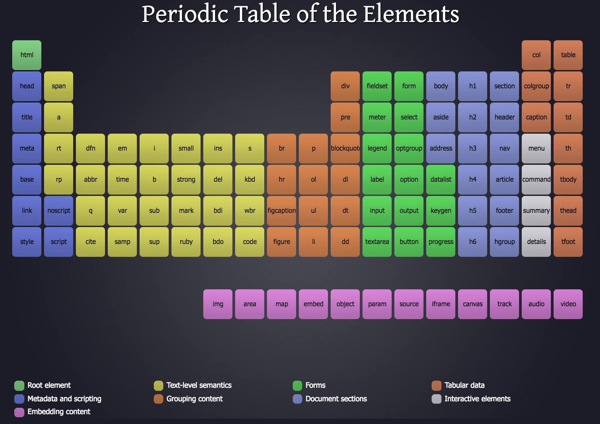

# Curso de HTML

## Índice

1. [Documentación](#documentación)
1. [Introducción](#introducción)
1. [Software necesario](#software-necesario)
1. [Creando mi primer documento HTML](#creando-mi-primer-documento-html)
1. [Emmet.io y atajos de VS Code](#emmetio-y-atajos-de-vs-code)
1. [Introducción a HTML y su documentación](#introducción-a-html-y-su-documentación)
1. [Estructura básica de un documento HTML](#estructura-básica-de-un-documento-html)
1. [Comentarios en HTML](#comentarios-en-html)
1. [Etiqueta HTML y el atributo _lang_](#etiqueta-html-y-el-atributo-lang)
1. [Etiqueta _DOCTYPE_](#etiqueta-doctype)
1. [Atributo _charset_](#atributo-charset)
1. [Metaetiqueta _Viewport_](#metaetiqueta-viewport)
1. [Título y descripciones](#títulos-y-descripciones)
1. [Tabla Periódica de los Elementos HTML](#tabla-peroódica-de-los-elementos-html)
1. [Encabezados](#encabezados)
1. [Etiquetas básicas de texto](#etiquetas-básicas-de-texto)
1. [Etiquetas de texto semánticas](#etiquetas-de-texto-semánticas)
1. [Etiquetas de salto](#etiquetas-de-salto)
1. [Etiquetas de formateo](#etiquetas-de-formateo)
1. [Etiquetas semánticas estructurales](#etiquetas-semánticas-estructurales)
1. [Interpretando la semántica en HTML](#interpretando-la-semántica-en-html)
1. [Etiquetas de línea y de bloque](#etiquetas-de-línea-y-de-bloque)
1. [Estilos en HTML](#estilos-en-html)
1. [Scripts en HTML](#scripts-en-html)
1. [Imágenes](#imágenes)
1. [Vectores](#vectores)
1. [Figuras](#figuras)
1. [Listas ordenadas](#listas-ordenadas)
1. [Listas desordenadas](#listas-desordenadas)
1. [Listas de definición](#listas-de-definición)
1. [Tablas](#tablas)
1. [Enlaces](#enlaces)
1. [Enlaces internos](#enlaces-internos)
1. [Enlaces y protocolos especiales](#enlaces-y-protocolos-especiales)
1. [Elementos interactivos](#elementos-interactivos)
1. [Audio y video](#audio-y-video)
1. [Iframes](#iframes)
1. [Elementos de formulario](#elementos-de-formularios)
1. [Atributos de inputs y formularios](#atributos-de-inputs-y-formularios)
1. [Select, Radios y Checkbox](#selects-radios-y-checkbox)
1. [Formulario de contacto](#formualrio-de-contacto)
1. [DataAtributtes](#dataatributtes)
1. [Metaetiquetas para SEO y Móviles](#metaetiquetas-para-seo-y-móviles)
1. [Metaetiquetas para redes sociales](#metaetiquetas-para-redes-sociales)
1. [Accesibilidad web](#accesibilidad-web)

---

## Documentación

- ### [MDN (Mozilla Developer Network)](https://developer.mozilla.org/en-US/)

- ### [htmlreference](https://htmlreference.io/)

[⬆️](#índice)

---

## Introducción

HTML es el lenguaje de marcado que nos define el contenido que vemos a través de los navegadores.

[⬆️](#índice)

---

## Software necesario

- Navegador Web

  - Recomendados
    - Chrome
    - FireFox
  - No Recomendados
    - Internet Explorer

- Editor de código: Es una herramienta que nos permite escribir código
  - Recomendaciones
    - Sublime Text
    - Atom (GitHub)
    - Brackets (Adobe)
    - _**Visual Studio Code**_ (Microsoft)

[⬆️](#índice)

---

## Creando mi primer documento HTML

- **IMPORTANTE:** Crear una carpeta para escribir los archivos de HTML.

- Se suele llamar _index_ al archivo principal de HTML por convención en el desarrollo web.

- Para nombrar archivos: - _nombre_archivo.extensión_ - v.gr.: **index.html**
  <br><br>
- Para ver el contenido del archivo HTML, se tiene que ir a la carpeta que contiene el archivo HTML y dar doble clic (En el Explorador de Archivos).

[⬆️](#índice)

---

## Emmet.io y atajos de VS Code

- VS Code tiene integrado el complemento Emmet.

- **Emmet** nos permite escribir código HTML y CSS de forma muy rápida.

- [Documentación de Emmet](https://emmet.io)

- [Atajos para VS Code](https://code.visualstudio.com/shortcuts/keyboard-shortcuts-windows.pdf)

[⬆️](#índice)

---

## Introducción a HTML y su documentación

- **HTML**: Defnie el contenido.
- **CSS**: Da estilos al contenido.
- **Javascript**: Programar contenido.

- HTML, CSS y JS se les conoce como estándares ya que cualquier navegador utilizan estas tecnologías para pintar la pagina en la web.

- Estas tecnologías están regidas por personas y deliminan los avances que los navegadores tienen que aceptar.

      - W3G y WhatWG son grupos de personas que rigen los estándares.

  <br>
  <br>

- Para leer la **documentación** de HTML se usa:

  - ### [MDN (Mozilla Developer Network)](https://developer.mozilla.org/en-US/)

    - Quienes sus desarrolladores son los mismos del navegador Firefox (Documentación NO oficial).

  - ### [htmlreference](https://htmlreference.io/)
    - Página que contiene referencias de HTML.

-

[⬆️](#índice)

---

## Estructura básica de un documento HTML

### Estructura

```HTML
<!DOCTYPE html>
<html lang="en">
<head>
    <meta charset="UTF-8">
    <meta http-equiv="X-UA-Compatible" content="IE=edge">
    <meta name="viewport" content="width=device-width, initial-scale=1.0">
    <title>Document</title>
</head>
<body>

</body>
</html>
```

- **HTML (Hyper Text Markup Language)**

- **Hyper**: Del griego que significa _"Navegación"_.

- HTML **NO** es un lenguaje de programación, es un <u>lenguaje de marcado</u>.

- Al crear el archivo, se debe crear con la extensión _**.html**_

- Los elementos del HTML son marcas o etiquetas. Empiezan con un **<** para abrir una etiqueta y cierra con un **>** (picoparéntesis).

- Hay etiquetas que tienen etiquetas de cierre (abre y cierra en diferente línea de código) y hay otras etiquetas que por su naturaleza cierran en la misma línea.

  | Etiqueta de apertura y cierre | Etiqueta de cierre |
  | :---------------------------: | :----------------: |
  |        `<head></head>`        |      `<meta>`      |

- Las etiquetas HTML pueden tener **atributos**.

- Para generar la [estructura básica de HTML](#estructura) (Requiere Emmet): `! + tab`

- Las etiquetas se escriben en minúsculas (como buena práctica, ya que HTML no distingue entre mayúsculas y minúsculas). _Salvo la etiqueta Doctype_.

- `<p></p>`: Etiqueta de párrafo.

- El documento HTML está compuesto por dos partes:

  - **_head_**

    - Enlazar a otros archivos (CSS, JS) o enlaces, títulos, descripciones. Toda la información dentro del head es información **meta** ya que es información que habla de la página pero los usuarios no vemos. Esta información **meta** es más usada los algoritmos que posicionan las páginas en los buscadores.

  - **_body_**
    - Todo lo que queramos que se vea va dentro del body.

- Es importante respetar la jerarquía de cómo han sido definidas las etiquetas. No va a arrojar error por no ser un lenguaje de programación pero al tener mal definidas las etiquetas según su jerarquía, puede que el aspecto visual este mal.

- Es importante la indentación (tabulación) para ser ordenado.

[⬆️](#índice)

---

## Comentarios en HTML

- Un comentario es un texto o notas que el navegador no va a interpretar. Son notas para nosotros dentro del código.

```HTML
<!-- Esto es un comentario -->

<!--
    Esto
    es un
    comentario
 -->

```

[⬆️](#índice)

---

## Etiqueta HTML y el atributo _lang_

- La etiqueta `<html>` es la que se encarga de tener la cabeza como el cuerpo del documento.

- Desde HTML5 (2009) la W3C hizo marketing para HTML. (En estas épocas se hacían las páginas web con Flash).

- Por cuestiones de posicionamiento es muy importante especificar el atributo del idioma en la etiqueta HTML.

- El atributo _lang_ especifica el idioma de la página (idioma del contenido). No es tan necesario especificar el idioma del contenido hasta cierto punto.

  - **_en_**: Inglés
  - **_jp_**: Japonés
  - **_es_**: Español
  - **_es-DOMINIO PAIS_**: Español local. Es recomendable para casos y contextos muy particulares. (El dominio del país va en MAYÚSCULAS).
    - es-MX: Español mexicano
    - es-CL: Español chileno.
  - **_es-419_**: Español latino y región del Caribe.

[⬆️](#índice)

---

## Etiqueta _DOCTYPE_

- Antes del HTML5, hubo HTML1, HTML2, HTML3, XHTML (fusión entre HTML y XML), HTML4 y en cada una de esas versiones había diferentes tipos de documentos y el DOCTYPE se volvía muy largo ya que se tenía que insertar una URL que especificaba la versión de HTML que se estaba usando en ese documento.

- Dependiendo del tipo de documento (tipo de DOCTYPE) algunas etiquetas eran soportadas y otras no o la visualización de las etiquetas era diferente.

- Por estas situaciones y dificultades, la W3C estandarizó los tipos de documentos y aceptó todas las etiquetas (todo en un solo tipo de versión y documento).

- El DOCTYPE especifica un tipo de documento con la versión **5**.

[⬆️](#índice)

---

## Atributo _charset_

```HTML
<meta charset="UTF-8">
```

- _charset_ hace referencia al juego de caracteres con la que está codifcada una página (relacionado con el idioma).

- UTF-8 es el juego de caracteres estándar.

- Si no se especifica el tipo de charset, los navegadores viejos no van a reconocer algunos caracteres como la ñ.

```HTML
<meta http-equiv="X-UA-Compatible" content="IE=edge">
```

- Se refiere a ajustar la configuración de Microsoft Edge a Internet Explorer.
- Esta etiqueta se puede borrar ya que no es un estándar.

[⬆️](#índice)

---

## Metaetiqueta _Viewport_

- La etiqueta del _viewport_ hace referencia a la zona visible del navegador donde se renderiza el contenido de HTML. Es importante la etiqueta que sea definida en todos los documentos HTML porque es la que le dice a los dispositivos cómo se va a adaptar el contenido.

```HTML
<meta name="viewport" content="width=device-width, initial-scale=1.0">
```

- **Por cuestiones de resposive design, es muy importante y hay que incluirla en todos los documentos HTML.**

- `width=device-width`: El ancho del documento HTML se va a adaptar al ancho del dispositivo.

- `initial-scale=1.0`: La escala inicial del contenido va a iniciar en 1 (100%).

[⬆️](#índice)

---

## Títulos y Descripciones

- El título se refiere al título del documento HTML (título tiene que ser referente a lo que se va a encontrar el usuario en la página que está visitando).

    <p style="font-size: 18px"><b>IMPORTANTE: El título debe estar entre 55 y 65 caracteres de longitud.</b></p>

- La metadescripción se defice:

```HTML
<meta name="description" content="Descripción de la página">
```

- `name="description"`: Sección que va por default.

- `content="Descripción de la página"`: Descripción de la página.
    <p style="font-size: 18px"><b>IMPORTANTE: La descripción no debe rebasar los 165 caracteres.</b></p>

- Las etiquetas de título y metadescripción nos va a ayudar mucho en el posicionamiento (SEO). Con esto hacemos SEO a nivel código.

- Un error muy común es dejarle el título y la metadescripción igual en todos los documentos HTML. Esto es un gran error porque si el sitio empieza a mejorar su posicionamiento, no se va a permitir el subíndice en los buscadores web (partes más visitadas de la página).

[⬆️](#índice)

---

## Tabla Peroódica de los Elementos HTML



- Etiquetas HTML ordenadas según su semántica y grupo.

  - Text-level semantics: Sirven para dar formato a texto.

[⬆️](#índice)

---

## Encabezados

- _**Nos van a permitir titularizar nuestro contenido**_.

- Los niveles generar una jerarquía semántica de contenido y cada nivel tiene diferentes formatos.

- Los encabezados también se toman en cuenta para el SEO.

    <p style="font-size: 18px"><b>IMPORTANTE: SÓLO SE AGREGA UN SOLO &lt;h1&gt;</b></p>

  - Esto debido a que los Growlers (también conocidas como Arañas. Algoritmos que buscan la info en los documentos HTML) seimpre se fijan en el h1 para el SEO.

  - Después del h1 único, se puede agregar tantos headings como se guste (según las necesidades).

  ```HTML
    <h1>Encabezado de nivel 1</h1>
    <h2>Encabezado de nivel 2</h2>
    <h3>Encabezado de nivel 3</h3>
    <h4>Encabezado de nivel 4</h4>
    <h5>Encabezado de nivel 5</h5>
    <h6>Encabezado de nivel 6</h6>
  ```

[⬆️](#índice)

---

## Etiquetas básicas de texto

```HTML
<p></p>             Nos permite tener un párrafo.
<b></b>             Negrita (Bold)
<i></i>             Cursiva (Italic)
<u></u>             Subrayado (se sugiere CSS para subrayado)
<sup></sup>         Superíndice
<sub></sub>         Subíndice
<mark></mark>       Marcatextos
<small></small>     Letras pequeñas
```

[⬆️](#índice)

---

## Etiquetas de texto semánticas

- Etiquetas semánticas: Referencia visual y con significado.

```HTML
<strong></strong>               Dar mayor importancia
<em></em>                       Hacer énfasis
<blockquote></blockquote>       Citar o hacer referencia (frase con indentación)
<cite></cite>                   Citar (autor)
<time></time>                   Define la hora en formato 24 hrs.
```

[⬆️](#índice)

---

## Etiquetas de salto

- **Estas etiquetas no tienen etiqueta de cierre**.

```HTML
<br>    Salto de línea
<hr>    Línea horizontal (Salto semántico de contenido)
```

[⬆️](#índice)

---

## Etiquetas de formateo

```HTML
<pre></pre>     Preformateo (deja el formato dado y cambia el tipo de tipografía)
<code></code>   Formato de código
```

- Si hay un bloque que queremos mostrar en una página pero no sale debido a que es una etiqueta y que el navegador la interpreta como tal, debemos cambiar los picoparéntesis por **\&lt;** (<) y **\&gt;** (>).

[⬆️](#índice)

---

## Etiquetas semánticas estructurales

- Maquetación: Proceso de delimitar el área de las diferentes secciones del sitio web.

- El proceso de maquetación va a depender de cómo esté organizado el diseño o UI de los sitios web.

- Cuando llegó HTML5, se crearon esas etiquetas semánticas porque antes se usaba `<div></div>` para dividir las zonas de contenido el cual es una etiqueta contenedora _sin semántica_.

- Está mal creer que solamente deba haber un pie de página o una sola cabecera.

```HTML
<header></header>       Representa la cabecera de un sitio o estructura.
<main></main>           Define la sección principal del documento.
<footer></footer>       Pie de página de un sitio web o de una sección del sitio.
<nav></nav>             Representa una navegación.
<article></article>     Representa una sección de autocontenido.
<aside></aside>         Representa un contenido complementario o secundario.
<section></section>     Representa una sección de contenido genérico.
<address></address>     Representa cualquier tipo de información de contacto.
```

- **Notas importantes**:

  - <p style="font-size: 18px"><b>IMPORTANTE: SÓLO SE AGREGA UN SOLA SOLA ETIQUETA &lt;main&gt;.</b></p>

  - La navegación consiste en un conjunto de enlaces que formen un menú de navegación.

  - Un `<article></article>` es una sección de autocontenido que por sí sola se entiende su contenido sin necesidad del contexto de la interfaz del sitio.

  - La etiqueta `<aside></aside>` nos sirve para agregar publicidad.

- La semántica ba a ser muy subjetivo con base a l tipo de contenido del sitio web (se puede meter un `<section></section>` dentro de un `<article></article>` o viceversa).

[⬆️](#índice)

---

## Interpretando la semántica en HTML

- La semántica nos define las necesidades del contenido a plasmar.

- En el `<article></article>` puede tener su propio `<header>`, `<footer>`, `<section>`. Útil para publicaciones de blog.

- Que la `<div>` no tenga una estructura semántica no significa que no se deban usar pero es recomendable tratar de usar una etiqueta semántica (header, footer, etc.) antes que el `<div>`.

[⬆️](#índice)

---

## Etiquetas de línea y de bloque

- De las etiquetas hay un conjunto que trabajan de forma de bloque y hay otras de línea.

|                                                                 Etiquetas de bloque                                                                  |                                    Etiquetas de línea                                    |
| :--------------------------------------------------------------------------------------------------------------------------------------------------: | :--------------------------------------------------------------------------------------: |
|                                                        Etiqueta de excelencia: `<div></div>`                                                         |                         Etiqueta de excelencia: `<span></span>`                          |
|                                                  Genera saltos de línea con sus etiquetas hermanas                                                   |                  Sólo ocupa el espacio necesario que tiene su contenido                  |
|                                             Ocupa todo el ancho de la pantalla. (Aunque no lo necesite)                                              |                       No genera saltos de línea ni arriba ni abajo                       |
| **Etiquetas**: Encabezados, párrafos, etiquetas estructurales (div, header, footer, etc.), Text-level semantics, Embedded content (img, video, etc.) | **Etiquetas**: Etiquetas de texto semánticas (negrita, cursiva, etc.), Document sections |

- **Notas importantes**:
  - La etiqueta `<span></span>` es un contenedor genérico de línea que tampoco tiene estructura semántica.

[⬆️](#índice)

---

## Estilos en HTML

- Formas de aplicar CSS:

  - Aplicar el atributo _**style**_ dentro de la etiqueta:
    - `style=""`
  - Aplicar la etiqueta dentro de la etiqueta `<head>`:
    - `<style></style>`.
  - En el `<head>` colocar la etiqueta _link_ (enlazar CSS, documentos de texto, favicons):
    - `<link rel="stylesheet" href="{ubicación de archivo}"/>`

- _**La forma correcta de aplicar CSS es a través de la etiqueta link**_.

[⬆️](#índice)

---

## Scripts en HTML

- Formas de aplicar JS:

  - Mediante la etiqueta `<script>` al final antes del cierre del body:

    - `<script></script>`

  - Mediante un archivo independiente. Para enlazar el archivo JS se usa:
    - `<script src="{ubicación archivo JS}"></script>`

- _**La forma correcta de aplicar JS es mediante un archivo externo a través de la etiqueta &lt;script&gt;**_.

[⬆️](#índice)

---

## Imágenes

- Etiqueta para agregar una imagen:

  - ``

- **El texto alternativo es para cargar por si la imagen está rota o no se puede cargar por algún motivo**.

- Es importante colocar un texto alternativo para que los screen readers usen dicho texto y ayudar a las personas con alguna discapacidad.

- Formatos soportados: JPG, PNG, GIF, SVG, etc.

- Las imágenes tienen el atributo `width=""` y `height=""` (ancho y alto). **Lo ideal para definir el alto y ancho de las imágenes, se usa CSS**.

- Ahora es popular utilizar el formato de vectores como imágenes (como logotipos).

[⬆️](#índice)

---

## Vectores

- Los vectores es código HTML.

- Se puede pegar el código SVG en el archivo HTML.

- Se puede visualizar la imagen SVG en HTML con la etiqueta ``.

- Si el código es muy grande, lo más recomendable es tratarlo como imagen y no como SVG usando el código.

[⬆️](#índice)

---

## Figuras

- La etiqueta semántica (self-content) que siempre será una imagen.

```HTML
<figure>
  
  <figcaption>Batman GIF</figcaption>
</figure>
```

[⬆️](#índice)

---

## Listas Ordenadas

- Lista enumerada.

- Etiqueta: `<ol></ol>`

  - Los elementos se colocan con la etiqueta: `<li></li>`

    - **&lt;li&gt;** quiere decir _List Item_ y va dentro de la etiqueta `<ol></ol>`

  |  Atributo  |                 Descripción                  | ¿Booleano? |       Valor       |
  | :--------: | :------------------------------------------: | :--------: | :---------------: |
  | `start=""` | Para empezar la lista en un número diferente |     ❌     |         #         |
  | `reversed` |    Para empezar la lista en orden inverso    |     ✅     |         -         |
  | `type=""`  |     Para cambiar el tipo de enumeración      |     ❌     | **1, i, I, a, A** |

### Ejemplo

```HTML
<ol start="2" type="A" reversed>
  <li>Objeto 1</li>
  <li>Objeto 2</li>
  <li>Objeto 3</li>
</ol>
```

- Los atributos van dentro de la etiqueta `<ol>`.

- El valor **1** es el predeterminado.

[⬆️](#índice)

---

## Listas Desordenadas

- Listas con viñetas.

- Etiqueta: `<ul></ul>`

  - Los elementos se colocan con la etiqueta: `<li></li>` dentro de `<ul></ul>`.

    | Atributo  |             Descripción             | ¿Booleano? |          Valor           |
    | :-------: | :---------------------------------: | :--------: | :----------------------: |
    | `type=""` | Para cambiar el tipo de enumeración |     ❌     | **circle, disc, square** |

- Los atributos van dentro de la etiqueta `<ul>`.

- El valor **disc** es el predeterminado.

[⬆️](#índice)

---

## Listas de Definición

- Lista de términos.

### Ejemplo

```HTML
<dl>
    <dt>HTML</dt>
    <dd>Es un lenguaje de marcado que define el contenido de la web.</dd>
</dl>
```

- `<dl></dl>`: Definition List (Lista de definición).
- `<dt></dt>`: Definition Term (Término de definición).
- `<dd></dd>`: Definition Data (Dato de definición).

[⬆️](#índice)

---

## Tablas

- Etiqueta: `<table></table>`.

- Primero definir la fila con `<tr></tr>` (Table Row).

- Después de definir las filas, definir las columnas `<td></td>` (Table Data).

  - **Se define dentro de `<tr></tr>`**.

- Para crear grupos de filas o darle una estructura semántica usar:

  - `<thead></thead>`: Table Header
  - `<tbody></tbody>`: Table Body
  - `<tfoot></tfoot>`: Table Foot

- Para colocar un header a la tabla, se usa `<th></th>` (Table Head).

|   Atributo   |       Descripción        | ¿Booleano? | Valor |
| :----------: | :----------------------: | :--------: | :---: |
| `colspan=""` | Unir celdas por columnas |     ❌     |   #   |
| `rowspan=""` |  Unir celdas por filas   |     ❌     |   #   |

### Ejemplo Tabla Simple

```HTML
<table>
    <tr>
      <td>Nombre</td>
      <td>Constelación</td>
      <td>Tipo</td>
    </tr>
    <tr>
      <td>Ikki</td>
      <td>Fénix</td>
      <td>Bronce</td>
    </tr>
    <tr>
      <td>Shaira</td>
      <td>Ofiuco</td>
      <td>Plata</td>
    </tr>
    <tr>
      <td>Saga</td>
      <td>Géminis</td>
      <td>Dorado</td>
    </tr>
  </table>
```

### Ejemplo Tabla Estructurada

```HTML
<table>
    <thead>
      <tr>
        <th colspan="3">Tabla de los Santos de Athena</th>
      </tr>
      <tr>
        <th>Nombre</th>
        <th>Constelación</th>
        <th>Tipo</th>
      </tr>
    </thead>
    <tbody>
      <tr>
        <!-- <td rowspan="2">Ikki</td> -->
        <td>Ikki</td>
        <td>Fénix</td>
        <td>Bronce</td>
      </tr>
      <tr>
        <td>Misty</td>
        <td>Lagarto</td>
        <td>Plata</td>
      </tr>
      <tr>
        <td>Saga</td>
        <td>Géminis</td>
        <td>Dorado</td>
      </tr>
      <tr>
        <td>Shaira</td>
        <td rowspan="2">Ofiuco</td>
        <td>Plata</td>
      </tr>
      <tr>
        <td>Odiseo</td>
        <td>Dorada</td>
      </tr>
    </tbody>
    <tfoot>
      <tr>
        <th colspan="3"><small>Saint Seiya fue creado por Masami Kurumada</small></th>
      </tr>
    </tfoot>
  </table>
```

[⬆️](#índice)

---

## Enlaces

- Elementos que nos permiten ir a otras rutas, archivos, URL, etc. Pueden ser enlaces relativos a carpeta donde estemos.

- Etiqueta: `<a href=""></a>`

  |  Atributo   |                Descripción                | ¿Booleano? |              Valor               |
  | :---------: | :---------------------------------------: | :--------: | :------------------------------: |
  |  `href=""`  |      Dirección a ruta, archivo o URL      |     ❌     |       {URL, documentos, directorio}        |
  | `target=""` |        Forma de abrir una pestaña         |     ❌     | \_blank, \_self, \_parent, \_top |
  |  `rel=""`   | La relación del link respecto a la página |     ❌     |             nofollow             |

- Si son enlaces externos, hay que poner _**http://**_ o _**https://**_ y el _**dominio**_.

- Los enlaces son etiquetas de línea.

- Para abrir un enlace en una nueva pestaña, se usa el atributo _target=""_ con el atributo \__blank_.

- Para enlaces externos, es recomendable agregar el atributo ``rel="nofollow"` para que las arañas sepan que dicho enlace no forma parte del sitio.

- También se pueden agregar imágenes o vectores como enlaces (colocar una etiqueta `` dentro de la etiqueta `<a href=""></a>`).

### Ejemplos

```HTML
<a href="hola.html">Hacia la página Hola</a>

<a href="https://jonmircha.com" rel="nofollow">Visita el sitio web jonmircha.com</a>

<a href="https://www.spotify.com/mx/" rel="nofollow" target="_blank">
    
</a>
```

[⬆️](#índice)

---

## Enlaces Internos

- Como usamos Enlaces Internos estamos en la misma URL o documento.

- El **#** nos ayuda a distinguir las diferentes anclas internas.

- Para usar enlaces internos, se debe hacer uso de los links e identificadores: ``id=""``.

- Usar caracteres en inglés (evitar caracteres ajenos al ingles). Si hay espacios, usar caracteres como el guión medio (-) o el guión bajo (_).

- Para enlazar una ancla interna dentro del mismo documento se agrega al _href=""_:

  - _**nombre_documento#id_elemento**_

### Ejemplo

```HTML
<h2 id="inicio">Aprendiendo HTML</h2>

<a href="index.html#inicio">⬆️</a> <!-- Esta etiqueta se enlaza al <h2> por el id -->
```

[⬆️](#índice)

---

## Enlaces y protocolos especiales

- También se pueden acceder a otros protocolos con los enlaces (acceder a aplicaciones predeterminadas, números de teléfono, etc.).

- En el ``href=""`` se coloca:

  |   Protocolo   |                  Descripción                  |      Valor     |
    | :----------: | :-------------------------------------------: | :------------: |
    | ``mailto:`` | Abre la app de correo con el correo que está en el _mailto:_  |      correo        |
    | ``tel:`` |     Abre la app de teléfono con el número de teléfono en el _tel:_    |      teléfono        |
    | API  | Uso de APIs de empresas como WhatsApp           | link de API |


### Ejemplo

```HTML
<a href="mailto:hola@gmail.com">Enlace a correo electrónico</a><br>
  
<a href="tel:2130928409184">Enlace a teléfono</a><br>

<!-- Ejemplo de mandar mensaje a un número de WhatsApp -->
<a href="https://api.whatsapp.com/send?phone=140812345&text=Hola" target="_blank">Enlace hacia WhatsApp</a>
```
[⬆️](#índice)

---

## Elementos Interactivos

- Elementos Interactivos:

  - Botones: ``<button></button>``
  
    - Para dar interactividad, se usa JavaScript.
    
    - Se considera mala práctica generar eventos de JS como atributos, en vez de usar un documento JS.

    ### Ejemplo de Botón

    ```HTML
    <button onclick="alert(`Hola, haz clickeado el botón`)">Este es un botón</button>
    ```
  
  - Details: ``<details></details>``

    - Uso de: ``<summary></summary>`` y ``<article></article>``
      
      |   Atributo   |                  Descripción                  | ¿Booleano? |      Valor     |
      | :----------: | :-------------------------------------------: | :--------: | :------------: |
      | ``open`` | Para mantener abierto la parte de details  |     ✅     |       -        |

    ### Ejemplo de Detail


    ```HTML
    <details open>
      <summary>Título del acordeón</summary> <!-- Título del acordeón -->

      <article> <!-- Contenido del acordeón -->
        <h3>Contenido del Acordeón</h3>
        <p>Lorem ipsum dolor sit amet consectetur adipisicing elit. Ipsa, dolores quisquam est sunt incidunt commodi ex cumque expedita alias molestias libero quaerat nisi enim! Culpa, et! Accusamus voluptates dolor excepturi?</p>
        <p>Lorem ipsum dolor sit amet consectetur adipisicing elit. Ipsa, dolores quisquam est sunt incidunt commodi ex cumque expedita alias molestias libero quaerat nisi enim! Culpa, et! Accusamus voluptates dolor excepturi?</p>
      </article>
    </details>
    ```

  - Cajas de dialogo o ventanas modales: ``<dialog></dialog>``

      |   Atributo   |                  Descripción                  | ¿Booleano? |      Valor     |
      | :----------: | :-------------------------------------------: | :--------: | :------------: |
      | ``open`` | Para mantener abierto la parte de details  |     ✅     |       -        |


    - Para las ventanas modales, lo recomendable es usar HTML y CSS.
    - Las ventanas modales es una etiqueta experimental.

    ### Ejemplo de Dialog
      ```HTML
      <dialog open>
          Esto es una ventana modal en HTML
      </dialog>
      ```

[⬆️](#índice)

---

## Audio y Video

- Por cada tipo de archivo, se realiza una carpeta.

- Las etiquetas de audio y video son **etiquetas de línea**.

- <p style="font-size: 22px">Audio:</p>
  
  |   Atributo   |                  Descripción                  | ¿Booleano? |      Valor     |
  | :----------: | :-------------------------------------------: | :--------: | :------------: |
  | ``controls`` | Para visualizar los controles de audio  |     ✅     |       -        |
  | ``autoplay`` | Para reproducir automáticamente el audio  |     ✅     |       -        |
  | ``loop`` | Para repetir el audio de forma automática  |     ✅     |       -        |
  | ``muted`` | Para silenciar el audio  |     ✅     |       -        |
  | ``preload`` | Para precargar el audio en el caché del navegador  |     ✅     |       -        |


  - Al poner el audio ya con la ruta del archivo, no se visualizará nada.

  - Para visualizar un reproductor de audio, se coloca el atributo booleano **_controls_**.

  - El atributo _**autoplay**_ no funciona con navegadores móviles. Además, requiere del permiso del usuario en el navegador para poder funcionar.
  
  - Es recomendable usar siempre el atributo **_preload_**.

  ### Ejemplo de Audio

  ```HTML
  <audio src="audio/Alvaro López & Resqband - Jericó (Performance Video).mp3" controls preload></audio>
  ```

- <p style="font-size: 22px">Audio:</p>
  
  |   Atributo   |                  Descripción                  | ¿Booleano? |      Valor     |
  | :----------: | :-------------------------------------------: | :--------: | :------------: |
  | ``controls`` | Para visualizar los controles de audio  |     ✅     |       -        |
  | ``autoplay`` | Para reproducir automáticamente el audio  |     ✅     |       -        |
  | ``loop`` | Para repetir el audio de forma automática  |     ✅     |       -        |
  | ``muted`` | Para silenciar el audio  |     ✅     |       -        |
  | ``preload`` | Para precargar el audio en el caché del navegador  |     ✅     |       -        |
  | ``poster=""`` | Para colocar poster en video si no se reproduce  |     ❌     |       {ruta de imagen}        |

  - El atributo _**autoplay**_ no funciona con navegadores móviles. Además, requiere del permiso del usuario en el navegador para poder funcionar.
  
  - Es recomendable usar siempre el atributo **_preload_**.

  - Para el atributo _**poster=""**_ es recomendable usar una imagen de igual resolución del video.

  ### Ejemplo de Video

  ```HTML
  <video src="video/Dirty Loops & Cory Wong - Follow The Light.mp4" poster="img/Batman SVG.svg" controls autoplay preload></video>
  ```

[⬆️](#índice)

---

## Iframes

[⬆️](#índice)

---

## Elementos de Formularios

[⬆️](#índice)

---

## Atributos de Inputs y Formularios

[⬆️](#índice)

---

## Selects, Radios y Checkbox

[⬆️](#índice)

---

## Formualrio de Contacto

[⬆️](#índice)

---

## DataAtributtes

[⬆️](#índice)

---

## Metaetiquetas para SEO y Móviles

[⬆️](#índice)

---

## Metaetiquetas para Redes Sociales

[⬆️](#índice)

---

## Accesibilidad Web

[⬆️](#índice)
